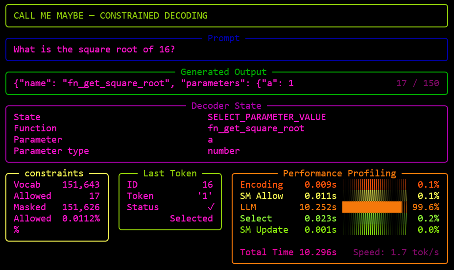
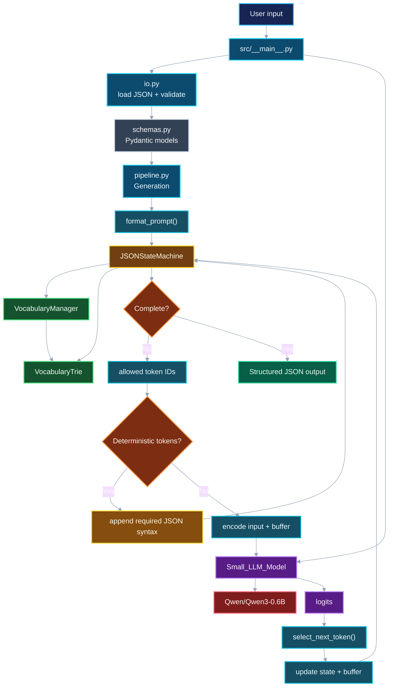
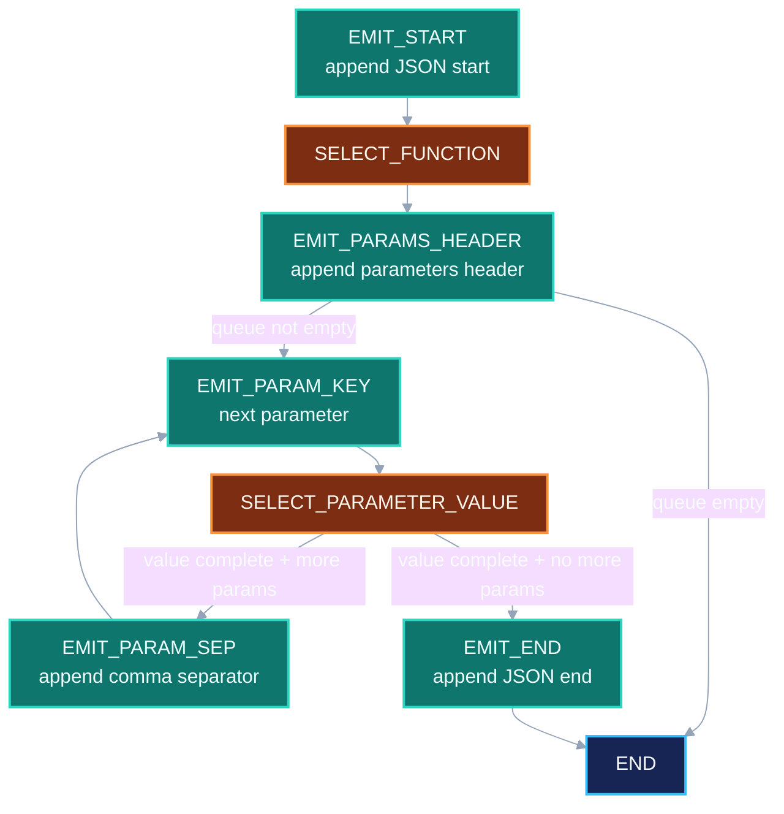

_This project has been created as part of the 42 curriculum by juliatav_

# Description

**Call Me Maybe** is a lightweight function-calling system that uses the Qwen3-0.6B language model to generate structured function calls from natural-language requests. The project explores how constrained decoding can guide a small LLM, which can be notoriously unreliable at producing structured output, to generate valid, schema-compliant JSON.

The system combines a state machine, JSON grammar constraints, and function schemas to control the generation process and ensure that the model's output follows the expected structure.

## Example Usage:
`make visualize`

---
# Instructions

### Install dependencies:
`make install`

### Run with defaults:
`make run`

Uses:
- `data/input/function_calling_tests.json` as the input file
- `data/input/functions_definition.json` as the functions definition file
- `data/output/function_calling_results.json` as the output file

### Run with custom INPUT and/or FUNCTIONS files:
`make run INPUT=<path-to-file> FUNCTIONS=<path-to-file>`

### Specify a custom output file:
`make run OUTPUT=<path-to-file>`

### Run with visualization enabled:
`make visualize`

### Run with the Python debugger:
`make debug`

### Clean generated files and caches:
`make clean`

Removes:
- Generated JSON files from `data/output/`
- Python `__pycache__` directories
- `.mypy_cache`
- `.pytest_cache`
- `.ruff_cache`

### Run linting:
`make lint`

Runs:
- `flake8`
- `mypy` with return-value, unused-ignore, missing-import, and untyped-definition checks

### Run strict linting:
`make lint-strict`

Runs:
- `flake8`
- `mypy --strict`

### Clean and run:
`make re`

Equivalent to:
`make clean && make run`
---
## Algorithm explanation:

The program uses token-level constrained decoding to generate valid JSON function calls. Generation first formats the user prompt together with the available function definitions, then initializes a JSONStateMachine. The state machine tracks whether the model is selecting a function name, generating a parameter value, emitting JSON syntax, or has reached the end. At each step, it calculates which token IDs are valid for the current state. Function names are restricted to the configured definitions, while parameter values are restricted according to their declared type: strings, numbers, and booleans each have different valid token sets.

To improve performance, the implementation combines LLM-generated tokens with deterministic token emission. JSON syntax such as opening braces, parameter names, separators, and closing braces is emitted directly whenever it is known in advance, avoiding unnecessary model calls. The vocabulary is also preprocessed by VocabularyManager, which builds token categories and a VocabularyTrie for efficient prefix lookups. When the next token is not deterministic, the model produces logits and select_next_token() masks every invalid token with negative infinity before selecting the highest-scoring valid token.

## Design decisions

The main design decision was to avoid calling the LLM when the next output is deterministic. The state machine therefore separates fixed JSON structure from LLM-driven states, using the model mainly for semantic tasks such as selecting a function and generating parameter values.

Vocabulary information is also precomputed to avoid repeatedly scanning the full vocabulary during generation. VocabularyManager categorizes relevant tokens, while VocabularyTrie enables efficient prefix-based lookups.

## Performance analysis

Performance is improved by reducing unnecessary model-inference steps, emitting deterministic JSON fragments in batches, pre-indexing vocabulary categories, and filtering logits to only valid token IDs. The pipeline also measures the time spent in encoding, state-machine filtering, inference, token selection, and state updates, with an optional Rich visualization for analyzing these measurements.

Reliability is improved by constraining the output throughout decoding rather than generating freely and validating afterward. Function names, parameter types, and JSON structure are all restricted according to the provided schemas, although semantic correctness still depends on the model's choices.

## Challenges faced

A major challenge was finding the right balance between deterministic emission and model generation. Emitting too much structure at once could interfere with state transitions and cause malformed output, while emitting too little reduced the performance benefit. I tested different approaches and adjusted the state transitions until deterministic output and model generation worked together reliably.

Meeting the runtime benchmark was another challenge. Profiling showed that performance was affected not only by the implementation, but also by factors such as logging, visualization, vocabulary processing, and the available CPU/GPU resources. Testing in different environments helped identify the impact of the development environment, including WSL, on Python and inference performance.

## Testing strategy

Testing was performed incrementally by inspecting state transitions, generated tokens, buffers, and allowed token IDs at each step. This made it easier to identify malformed output and incorrect transitions while developing the state machine.

I also created test inputs covering strings, numbers, booleans, multiple parameters, and edge cases, and compared different implementation approaches. The Rich visualization was later used to complement these tests by displaying the current state, selected function, parameter type, allowed-token count, generated tokens, and timing information.

## System Architecture & Workflow

### State Machine:

---
# Resources

### FMS
- [FMS — Function/Model Sampling](https://www.youtube.com/watch?v=4rNYAvsSkwk)

### Function Calling in LLMs
- [LLM Function Calling Explained](https://medium.com/@jamestang/llm-function-calling-explained-a-deep-dive-into-the-request-and-response-payloads-894800fcad75)
- [Function Calling in LLMs](https://www.youtube.com/watch?v=gosZ_vqXkMI)

### LLMs
- [Introduction to LLMs](https://www.youtube.com/watch?v=wjZofJX0v4M)
- [LLMs — How They Work](https://www.youtube.com/watch?v=IHZwWFHWa-w)
- [LLM Fundamentals](https://www.youtube.com/watch?v=xpvFinvqRCA)
- [Tokenization and LLMs](https://www.youtube.com/watch?v=6FIvLzTU_3s)

### JSON Schema
- [JSON Schema](https://www.youtube.com/watch?v=TAgUvtKLOOE)

### Constraint Decoding
- [Constrained Decoding: Forcing LLMs to Respect Your Taxonomy](https://pub.towardsai.net/constrained-decoding-forcing-llms-to-respect-your-taxonomy-3aaaf13329f9)

## AI Usage

AI tools were used as a support during the development of this project. They were used to clarify concepts related to LLMs, tokenization, function calling, JSON Schema, and constrained decoding, as well as to help investigate implementation issues and improve and format the README/docstring documentation.

The project's architecture, algorithms, and implementation were developed and reviewed by the author. AI-generated suggestions were treated as assistance and were tested and adapted where appropriate.
